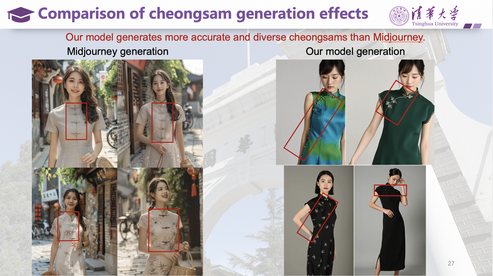

## About Me: Ming Zhou (周明)

I am currently an assistant researcher at the Institute of Computing Technology (ICT), Chinese Academy of Sciences. I obtained my Ph.D. supervised by [Prof. Jie Tang](https://keg.cs.tsinghua.edu.cn/jietang/) at the [Knowledge Engineering Group](https://keg.cs.tsinghua.edu.cn/), Department of Computer Science and Technology in Tsinghua University, Beijing, China. Before joining Tsinghua, I was a researcher at Baidu and Tencent. 

My research focuses on large language models (LLMs), AI for science, multi-modal data mining, graph representation learning, and social & information networks. I have published in premier venues of LLMs, AI for science, graph neural networks (GNNs), and social networks, including [a best student paper in ECML-PKDD 2023](https://2023.ecmlpkdd.org/program/awards/). Furthermore, relying on my self-developed algorithms, I developed and launched two systems:
(1) AIGC-assisted cheongsam design platform, which has surpassed the state-of-the-art text-to-image foundational model, Midjourney, in cheongsam design generation. The comparative experimental results are shown in the figure below:

(2) Social bot detection platform [Botdetection](https://botdetection.aminer.cn/robotmain), which has received widespread attention and is currently ranked No.1 in Google search.

## News

- **[Mar. 2025]** Our paper "LGB: Language Model and Graph Neural Network-Driven Social Bot Detection" has been accepted by *IEEE Transactions on Knowledge and Data Engineering (TKDE 2025)*.
- **[Oct. 2023]** Ming Zhou serves as [the chair of Session 5A](https://uobevents.eventsair.com/cikm2023/programme---tuesday-24th-october) at CIKM 2023.
- **[Sep. 2023]** Our paper "Semi-Supervised Social Bot Detection with Initial Residual Relation Attention Networks" has received **the best student paper award** at *Joint European Conference on Machine Learning and Knowledge Discovery in Databases (ECML-PKDD 2023)*.
- **[Aug. 2023]** Our paper "Detecting Social  Bot on the Fly using  Contrastive  Learning" has been accepted for presentation at *Proceedings of the 32nd ACM International Conference on Information and Knowledge Management (CIKM 2023)*.
- **[Jun. 2023]** Our paper "Semi-Supervised Social Bot Detection with Initial Residual Relation Attention Networks" has been accepted for presentation at *Joint European Conference on Machine Learning and Knowledge Discovery in Databases (ECML-PKDD 2023)*.




